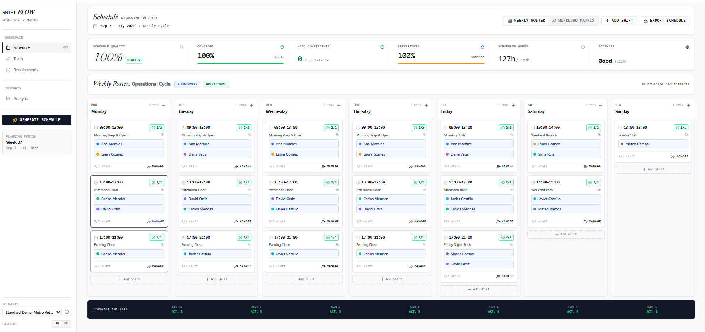

# ShiftFlow

**Workforce Scheduling & Shift Planner**

Constraint-based weekly planning, automated heuristic scheduling, conflict detection, and coverage analysis.

## Features

- Weekly shift scheduling with constraint-based planning
- Automated heuristic scheduling
- Conflict detection
- Coverage analysis

## Run Locally

**Prerequisites:** Node.js

1. Install dependencies:
   `npm install`
2. Set the `GEMINI_API_KEY` in `.env.local` to your Gemini API key
3. Run the app:
   `npm run dev`

## Contributors

<a href="https://github.com/kossto82-ops">
  
   
  <b>Raúl Rodríguez Cruz</b>
   
  @kossto82-ops
</a>
